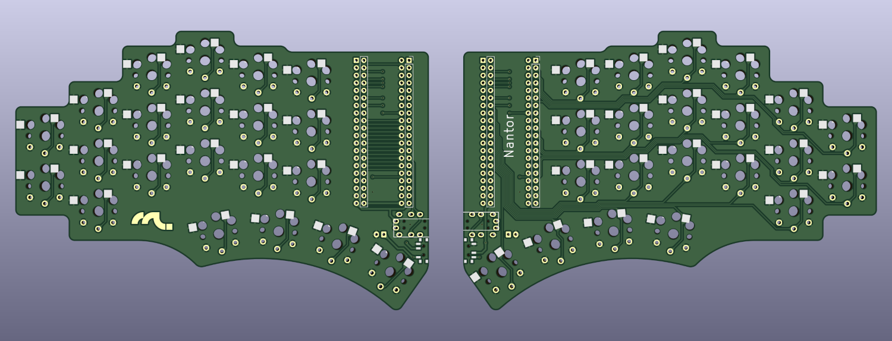

# Nantor

A wireless 42-key split keyboard made for Kailh Choc switches.



**Features**
* Flippable design
* [PillBug] support
* [BlackPill] support
* Wired and wireless support
* Battery power support
* Hotswap switches support

## Hardware

The board was designed with [KiCad] and can be found in [board/kicad](board/kicad).

The gerber files can be found in [board/kicad/gerber](board/kicad/gerber).

## ZMK

For wireless and wired mode. This firmware assumes that [PillBug] is being used.

> [!TIP]
>
> This is the latest and recommended configuration.

### Layout

> [!NOTE]
>
> Definition available at [zmk/shared/config/boards/shields/nantor/nantor.keymap](zmk/shared/config/boards/shields/nantor/nantor.keymap)

#### Base (colemak)
```
    ┌───┬───┬───┬───┬───┐       ┌───┬───┬───┬───┬───┐
┌───┤ Q │ W │ F │ P │ B │       │ J │ L │ U │ Y │ ; ├───┐
│Esc├───┼───┼───┼───┼───┤       ├───┼───┼───┼───┼───┤ ' │
├───┤ A │ R │ S │ T │ G │       │ M │ N │ E │ I │ O ├───┤
│Alt├───┼───┼───┼───┼───┤       ├───┼───┼───┼───┼───┤ \ │
└───┤ Z │ X │ C │ D │ V │       │ K │ H │ , │ . │ / ├───┘
    └───┴───┴───┴───┴───┘       └───┴───┴───┴───┴───┘
          ┌───┐                           ┌───┐
          │Bsp├───┐                   ┌───┤FNS│
          └───┤Spc├───┐           ┌───┤Ent├───┘
              └───┤Sft├───┐   ┌───┤NUM├───┘
                  └───┤ ⌘ │   │Ctl├───┘
                      └───┘   └───┘
```

#### Base (qwerty)
```
    ┌───┬───┬───┬───┬───┐       ┌───┬───┬───┬───┬───┐
┌───┤ Q │ W │ E │ R │ T │       │ Y │ U │ I │ O │ P ├───┐
│Esc├───┼───┼───┼───┼───┤       ├───┼───┼───┼───┼───┤ ' │
├───┤ A │ S │ D │ F │ G │       │ H │ J │ K │ L │ ; ├───┤
│Alt├───┼───┼───┼───┼───┤       ├───┼───┼───┼───┼───┤ \ │
└───┤ Z │ X │ C │ V │ B │       │ N │ M │ , │ . │ / ├───┘
    └───┴───┴───┴───┴───┘       └───┴───┴───┴───┴───┘
          ┌───┐                           ┌───┐
          │Bsp├───┐                   ┌───┤FNS│
          └───┤Spc├───┐           ┌───┤Ent├───┘
              └───┤Sft├───┐   ┌───┤NUM├───┘
                  └───┤ ⌘ │   │Ctl├───┘
                      └───┘   └───┘
```

#### Numbers
```
    ┌───┬───┬───┬───┬───┐       ┌───┬───┬───┬───┬───┐
┌───┤ = │ 7 │ 8 │ 9 │ 0 │       │Hom│PDn│PUp│End│Sft├───┐
│ ∆ ├───┼───┼───┼───┼───┤       ├───┼───┼───┼───┼───┤Ctl│
├───┤ - │ 4 │ 5 │ 6 │ [ │       │ ← │ ↓ │ ↑ │ → │ ⌘ ├───┤
│ ∆ ├───┼───┼───┼───┼───┤       ├───┼───┼───┼───┼───┤Alt│
└───┤ ` │ 1 │ 2 │ 3 │ ] │       │Del│Tab│ ∆ │ ∆ │ ∆ ├───┘
    └───┴───┴───┴───┴───┘       └───┴───┴───┴───┴───┘
          ┌───┐                           ┌───┐
          │ ∆ ├───┐                   ┌───┤BLT│
          └───┤ ∆ ├───┐           ┌───┤ ∆ ├───┘
              └───┤ ∆ ├───┐   ┌───┤ ∆ ├───┘
                  └───┤ ∆ │   │ ∆ ├───┘
                      └───┘   └───┘
```

#### Functions
```
     ┌───┬───┬───┬───┬───┐       ┌───┬───┬───┬───┬───┐
 ┌───┤Ins│ F9│F10│F11│F12│       │   │ B-│ B+│   │   ├───┐
 │ ∆ ├───┼───┼───┼───┼───┤       ├───┼───┼───┼───┼───┤   │
 ├───┤Cap│ F5│ F6│ F7│ F8│       │   │ ◄ │ ‖ │ ► │   ├───┤
 │ ∆ ├───┼───┼───┼───┼───┤       ├───┼───┼───┼───┼───┤   │
 └───┤PSc│ F1│ F2│ F3│ F4│       │   │ V-│ V0│ V+│   ├───┘
     └───┴───┴───┴───┴───┘       └───┴───┴───┴───┴───┘
           ┌───┐                           ┌───┐
           │ ∆ ├───┐                   ┌───┤ ∆ │
           └───┤ ∆ ├───┐           ┌───┤ ∆ ├───┘
               └───┤ ∆ ├───┐   ┌───┤BLT├───┘
                   └───┤ ∆ │   │ ∆ ├───┘
                       └───┘   └───┘
```

#### Bluetooth
```
    ┌───┬───┬───┬───┬───┐       ┌───┬───┬───┬───┬───┐
┌───┤   │   │   │   │BTC│       │   │   │   │   │   ├───┐
│ ∆ ├───┼───┼───┼───┼───┤       ├───┼───┼───┼───┼───┤CLM│
├───┤BLE│BT3│BT4│   │   │       │   │   │   │   │   ├───┤
│ ∆ ├───┼───┼───┼───┼───┤       ├───┼───┼───┼───┼───┤QWT│
└───┤USB│BT0│BT1│BT2│   │       │   │   │   │   │   ├───┘
    └───┴───┴───┴───┴───┘       └───┴───┴───┴───┴───┘
          ┌───┐                           ┌───┐
          │ ∆ ├───┐                   ┌───┤ ∆ │
          └───┤ ∆ ├───┐           ┌───┤ ∆ ├───┘
              └───┤ ∆ ├───┐   ┌───┤ ∆ ├───┘
                  └───┤ ∆ │   │ ∆ ├───┘
                      └───┘   └───┘
```

### Flashing

> [!NOTE]
>
> This is assuming that the board being used is the PillBug (nRF52840)

1. [Build the images](#build-the-images)
2. [Enter UF2 mode](#enter-uf2-mode)
3. [Load the images](#load-the-images)

#### Build the images

```bash
$ ./zmk/devcontainer.sh build p
```
> [!NOTE]
>
> The above command will do a pristine build. Check [zmk/devcontainer.sh](zmk/devcontainer.sh) for more options.

The output files will be located at `zmk/shared/build/(left|right)/zephyr/zmk.uf2`.

#### Enter UF2 mode

1. Connect the USB cable
2. Reset twice. To reset, either press the reset button or pull the `RST` pin down to `GND`
3. The board should show up as a storage device

#### Load the images

The board should be available as a USB storage device. Copy the `zmk/shared/build/(left|right)/zephyr/zmk.uf2` files to this new device. It should flash and reset automatically.

## QMK

For wired mode. This firmware assumes that [BlackPill] is being used.

> [!WARNING]
>
> This is the first version of **Nantor** and is no longer actively maintained.

[PillBug]: https://mechwild.com/product/pillbug
[BlackPill]: https://stm32-base.org/boards/STM32F103C8T6-Black-Pill.html
[KiCad]: https://www.kicad.org
