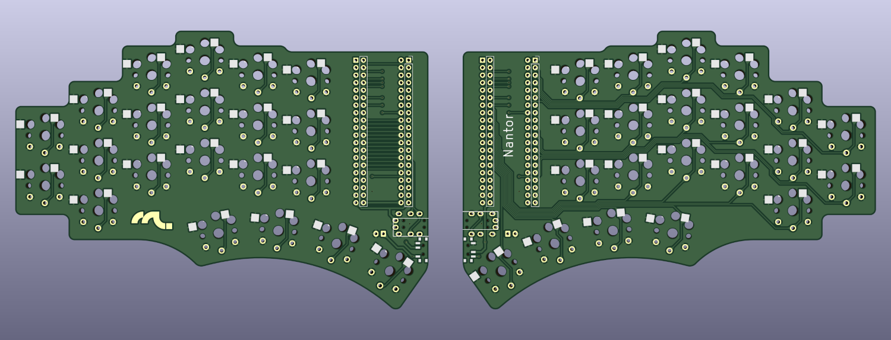
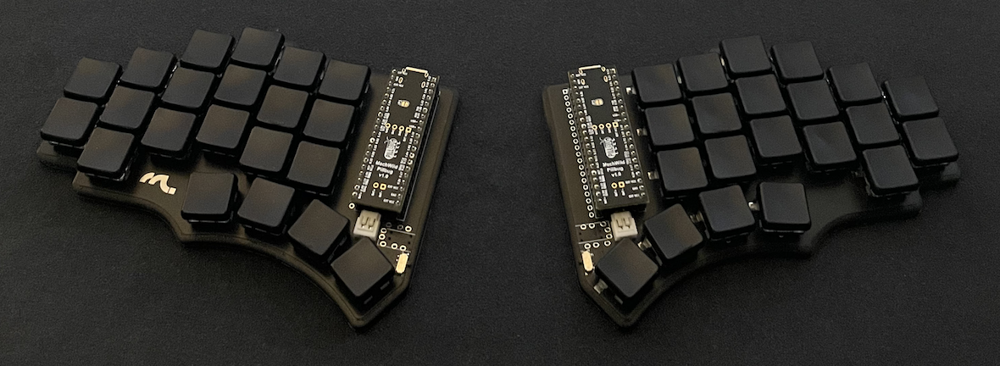

# Nantor

A wireless 42-key split keyboard made for Kailh Choc switches.





**Features**

- Flippable design
- [PillBug] support
- [BlackPill] support
- Wired and wireless support
- Battery power support
- Hotswap switches support

## Hardware

The board was designed with [KiCad] and can be found in [board/kicad](board/kicad).

The gerber files can be found in [board/kicad/gerber](board/kicad/gerber).

## ZMK

For wireless and wired mode. This firmware assumes that [PillBug] is being used.

> [!TIP]
>
> This is the latest and recommended configuration.

### Layout

> [!NOTE]
>
> Definition available at [zmk/shared/config/boards/shields/nantor/nantor.keymap](zmk/shared/config/boards/shields/nantor/nantor.keymap)

#### Base (colemak)

```
            ╭───╮                       ╭───╮
        ╭───┤ F ├───┬───╮       ╭───┬───┤ U ├───╮
    ╭───┤ W ├───┤ P │ B │       │ J │ L ├───┤ Y ├───╮
╭───┤ Q ├───┤ S ├───┼───┤       ├───┼───┤ E ├───┤ ; ├───╮
│Esc├───┤ R ├───┤ T │ G │       │ M │ N ├───┤ I ├───┤ ' │
├───┤ A ├───┤ C ├───┼───┤       ├───┼───┤ , ├───┤ O ├───┤
│Alt├───┤ X ├───┤ D │ V │       │ K │ H ├───┤ . ├───┤ \ │
╰───┤ Z ├───┘   ╰───┴───╯       ╰───┴───╯   ╰───┤ / ├───╯
    ╰───╯     ╭───┬───╮           ╭───┬───╮     ╰───╯
          ╭───┤Spc│Sft├───╮   ╭───┤NUM│Ent├───╮
          │Bsp├───┴───┤ ⌘ │   │Ctl├───┴───┤FNS│
          ╰───╯       ╰───╯   ╰───╯       ╰───╯
```

#### Base (qwerty)

```
            ╭───╮                       ╭───╮
        ╭───┤ E ├───┬───╮       ╭───┬───┤ I ├───╮
    ╭───┤ W ├───┤ R │ T │       │ Y │ U ├───┤ O ├───╮
╭───┤ Q ├───┤ D ├───┼───┤       ├───┼───┤ K ├───┤ P ├───╮
│Esc├───┤ S ├───┤ F │ G │       │ H │ J ├───┤ L ├───┤ ' │
├───┤ A ├───┤ C ├───┼───┤       ├───┼───┤ , ├───┤ ; ├───┤
│Alt├───┤ X ├───┤ V │ B │       │ N │ M ├───┤ . ├───┤ \ │
╰───┤ Z ├───┘   ╰───┴───╯       ╰───┴───╯   ╰───┤ / ├───╯
    ╰───╯     ╭───┬───╮           ╭───┬───╮     ╰───╯
          ╭───┤Spc│Sft├───╮   ╭───┤NUM│Ent├───╮
          │Bsp├───┴───┤ ⌘ │   │Ctl├───┴───┤FNS│
          ╰───╯       ╰───╯   ╰───╯       ╰───╯
```

#### Numbers

```
            ╭───╮                       ╭───╮
        ╭───┤ 8 ├───┬───╮       ╭───┬───┤PUp├───╮
    ╭───┤ 7 ├───┤ 9 │ 0 │       │Hom│PDn├───┤End├───╮
╭───┤ = ├───┤ 5 ├───┼───┤       ├───┼───┤ ↑ ├───┤Sft├───╮
│Esc├───┤ 4 ├───┤ 6 │ [ │       │ ← │ ↓ ├───┤ → ├───┤Ctl│
├───┤ - ├───┤ 2 ├───┼───┤       ├───┼───┤ , ├───┤ ⌘ ├───┤
│Alt├───┤ 1 ├───┤ 3 │ ] │       │Del│Tab├───┤ . ├───┤Alt│
╰───┤ ` ├───┘   ╰───┴───╯       ╰───┴───╯   ╰───┤ / ├───╯
    ╰───╯     ╭───┬───╮           ╭───┬───╮     ╰───╯
          ╭───┤Spc│Sft├───╮   ╭───┤ ∆ │Ent├───╮
          │Bsp├───┴───┤ ⌘ │   │Ctl├───┴───┤CFG│
          ╰───╯       ╰───╯   ╰───╯       ╰───╯
```

#### Functions

```
            ╭───╮                       ╭───╮
        ╭───┤F10├───┬───╮       ╭───┬───┤+B ├───╮
    ╭───┤ F9├───┤F11│F12│       │   │-B ├───┤   ├───╮
╭───┤Ins├───┤ F6├───┼───┤       ├───┼───┤ ‖ ├───┤Sft├───╮
│Esc├───┤ F5├───┤ F7│ F8│       │   │ ◄ ├───┤ ► ├───┤Ctl│
├───┤Cap├───┤ F2├───┼───┤       ├───┼───┤ V0├───┤ ⌘ ├───┤
│Alt├───┤ F1├───┤ F3│ F4│       │   │-V ├───┤+V ├───┤Alt│
╰───┤PSc├───┘   ╰───┴───╯       ╰───┴───╯   ╰───┤   ├───╯
    ╰───╯     ╭───┬───╮           ╭───┬───╮     ╰───╯
          ╭───┤Spc│Sft├───╮   ╭───┤CFG│Ent├───╮
          │Bsp├───┴───┤ ⌘ │   │Ctl├───┴───┤ ∆ │
          ╰───╯       ╰───╯   ╰───╯       ╰───╯
```

#### Config

```
            ╭───╮                       ╭───╮
        ╭───┤   ├───┬───╮       ╭───┬───┤   ├───╮
    ╭───┤   ├───┤   │BTC│       │   │   ├───┤   ├───╮
╭───┤   ├───┤BT4├───┼───┤       ├───┼───┤   ├───┤   ├───╮
│   ├───┤BT3├───┤   │   │       │   │   ├───┤   ├───┤CLM│
├───┤BLE├───┤BT1├───┼───┤       ├───┼───┤   ├───┤   ├───┤
│   ├───┤BT0├───┤BT2│   │       │   │   ├───┤   ├───┤QWT│
╰───┤USB├───┘   ╰───┴───╯       ╰───┴───╯   ╰───┤   ├───╯
    ╰───╯     ╭───┬───╮           ╭───┬───╮     ╰───╯
          ╭───┤   │   ├───╮   ╭───┤ ∆ │BLT├───╮
          │   ├───┴───┤   │   │BAT├───┴───┤ ∆ │
          ╰───╯       ╰───╯   ╰───╯       ╰───╯
```

### Flashing

> [!NOTE]
>
> This is assuming that the board being used is the PillBug (nRF52840)

1. [Build the images](#build-the-images)
2. [Enter UF2 mode](#enter-uf2-mode)
3. [Load the images](#load-the-images)

#### Build the images

```bash
$ ./zmk/devcontainer.sh build p
```

> [!NOTE]
>
> The above command will do a pristine build. Check [zmk/devcontainer.sh](zmk/devcontainer.sh) for more options.

The output files will be located at `zmk/shared/build/(left|right)/zephyr/zmk.uf2`.

#### Enter UF2 mode

1. Connect the USB cable
2. Reset twice. To reset, either press the reset button or pull the `RST` pin down to `GND`
3. The board should show up as a storage device

#### Load the images

The board should be available as a USB storage device. Copy the `zmk/shared/build/(left|right)/zephyr/zmk.uf2` files to this new device. It should flash and reset automatically.

## QMK

For wired mode. This firmware assumes that [BlackPill] is being used.

> [!WARNING]
>
> This is the first version of **Nantor** and is no longer actively maintained.

[PillBug]: https://mechwild.com/product/pillbug
[BlackPill]: https://stm32-base.org/boards/STM32F103C8T6-Black-Pill.html
[KiCad]: https://www.kicad.org
